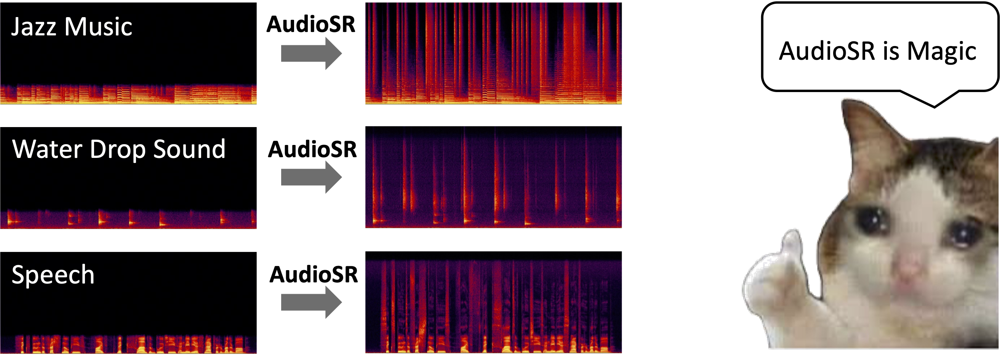

# AudioSR: Versatile Audio Super-resolution at Scale

Pass your audio in, AudioSR will make it high fidelity! 

Work on all types of audio (e.g., music, speech, dog, raining, ...) & all sampling rates.



## TODO
- [ ] Add gradio demo.
- [ ] Optimize the inference speed.

## Commandline Usage

## Installation
```shell
# Optional
conda create -n audiosr python=3.9; conda activate audiosr
# Install AudioLDM
pip3 install git+https://github.com/haoheliu/versatile_audio_super_resolution
```

## Usage

Process a list of files. The result will be saved at ./output by default.

```shell
audiosr -il batch.lst
```

Process a single audio file.
```shell
audiosr -i example/music.wav
```

Full usage instruction

```shell
> audiosr -h

> usage: audiosr [-h] -i INPUT_AUDIO_FILE [-il INPUT_FILE_LIST] [-s SAVE_PATH] [--model_name {basic,speech}] [-d DEVICE] [--ddim_steps DDIM_STEPS] [-gs GUIDANCE_SCALE] [--seed SEED]

optional arguments:
  -h, --help            show this help message and exit
  -i INPUT_AUDIO_FILE, --input_audio_file INPUT_AUDIO_FILE
                        Input audio file for audio super resolution
  -il INPUT_FILE_LIST, --input_file_list INPUT_FILE_LIST
                        A file that contains all audio files that need to perform audio super resolution
  -s SAVE_PATH, --save_path SAVE_PATH
                        The path to save model output
  --model_name {basic,speech}
                        The checkpoint you gonna use
  -d DEVICE, --device DEVICE
                        The device for computation. If not specified, the script will automatically choose the device based on your environment.
  --ddim_steps DDIM_STEPS
                        The sampling step for DDIM
  -gs GUIDANCE_SCALE, --guidance_scale GUIDANCE_SCALE
                        Guidance scale (Large => better quality and relavancy to text; Small => better diversity)
  --seed SEED           Change this value (any integer number) will lead to a different generation result.
```

## Cite our work

If you find this repo useful, please consider citing our work 