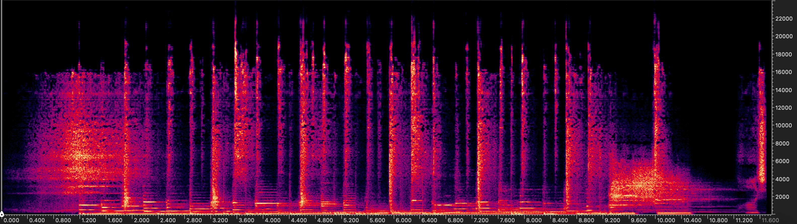

# AudioSR: Versatile Audio Super-resolution at Scale

[](https://arxiv.org/abs/2309.07314)  [](https://audioldm.github.io/audiosr) [](https://replicate.com/nateraw/audio-super-resolution)

Pass your audio in, AudioSR will make it high fidelity! 

Work on all types of audio (e.g., music, speech, dog, raining, ...) & all sampling rates.

Share your thoughts/samples/issues in our discord channel: https://discord.gg/HWeBsJryaf


## Change Log
- 2025-06-28: Add [LSD calculation pitfall demonstration](example/lsd_calculation_pitfall/README.md) showing the importance of energy scaling for fair Log Spectral Distance evaluation.
- 2024-12-31: The training code of AudioSR can be found [here](https://drive.google.com/file/d/1BaZuHbk1AfURX7SvkaD5_ZWLwun-wdpW/view?usp=drive_link) (For reference only. The code is not carefully organized.).
- 2024-12-16: Add [Important things to know to make AudioSR work](example/how_to_make_audiosr_work.md).

- 2023-09-24: Add replicate demo (@nateraw); Fix error on windows, librosa warning etc (@ORI-Muchim).  
- 2023-09-16: Fix DC shift issue. Fix duration padding bug. Update default DDIM steps to 50.

## Gradio Demo

To run the Gradio demo locally:

1. Install dependencies: `pip install -r requirements.txt` 
2. Run the app: `python app.py`
3. Open the URL displayed to view the demo

## Commandline Usage

## Installation
```shell
# Optional
conda create -n audiosr python=3.9; conda activate audiosr
# Install AudioLDM
pip3 install audiosr==0.0.7
# or
# pip3 install git+https://github.com/haoheliu/versatile_audio_super_resolution.git
```

## Usage

Process a list of files. The result will be saved at ./output by default.

```shell
audiosr -il batch.lst
```

Process a single audio file.
```shell
audiosr -i example/music.wav
```

Full usage instruction

```shell
> audiosr -h

> usage: audiosr [-h] -i INPUT_AUDIO_FILE [-il INPUT_FILE_LIST] [-s SAVE_PATH] [--model_name {basic,speech}] [-d DEVICE] [--ddim_steps DDIM_STEPS] [-gs GUIDANCE_SCALE] [--seed SEED]

optional arguments:
  -h, --help            show this help message and exit
  -i INPUT_AUDIO_FILE, --input_audio_file INPUT_AUDIO_FILE
                        Input audio file for audio super resolution
  -il INPUT_FILE_LIST, --input_file_list INPUT_FILE_LIST
                        A file that contains all audio files that need to perform audio super resolution
  -s SAVE_PATH, --save_path SAVE_PATH
                        The path to save model output
  --model_name {basic,speech}
                        The checkpoint you gonna use
  -d DEVICE, --device DEVICE
                        The device for computation. If not specified, the script will automatically choose the device based on your environment.
  --ddim_steps DDIM_STEPS
                        The sampling step for DDIM
  -gs GUIDANCE_SCALE, --guidance_scale GUIDANCE_SCALE
                        Guidance scale (Large => better quality and relavancy to text; Small => better diversity)
  --seed SEED           Change this value (any integer number) will lead to a different generation result.
  --suffix SUFFIX       Suffix for the output file
```


## TODO
[](https://www.buymeacoffee.com/haoheliuP)

- [ ] Add gradio demo.
- [ ] Optimize the inference speed.

## Cite our work
If you find this repo useful, please consider citing: 
```bibtex
@inproceedings{liu2024audiosr,
  title={{AudioSR}: Versatile audio super-resolution at scale},
  author={Liu, Haohe and Chen, Ke and Tian, Qiao and Wang, Wenwu and Plumbley, Mark D},
  booktitle={IEEE International Conference on Acoustics, Speech and Signal Processing},
  pages={1076--1080},
  year={2024},
  organization={IEEE}
}
```

# Understanding the Impact of Cutoff Patterns on AudioSR Performance

**AudioSR** is a powerful tool for audio super-resolution. However, its performance can be significantly influenced by the characteristics of the input data, especially the cutoff pattern. 

## 🚩 When AudioSR May Fail
1. **Input Audio with Unfamiliar Cutoff Patterns**  
   If the input audio file contains a cutoff pattern that is **significantly different** from those used in training, AudioSR may fail to perform effectively.
   
2. **Input Audio with Severe Distortions**  
   Strong distortions such as excessive noise or reverb can degrade the performance of AudioSR.

## ❓ Why Do Cutoff Patterns Have Such a Huge Impact on AudioSR?
During training, our data was simulated using **low-pass filtering**. The model was not trained to handle other causes of high-frequency loss, such as MP3 compression. As a result, AudioSR struggles when encountering unfamiliar cutoff patterns.

For example, MP3 compression can introduce a cutoff pattern that looks like this:


### Why This Matters
As you can see, there are **spectrogram holes** near the cutoff range, which differ significantly from the patterns seen during training. When you apply AudioSR to such data, the output may look like this:



The higher frequencies are not adequately inpainted due to the unfamiliar cutoff pattern.

### A Simple Solution: Low-Pass Filtering
To mitigate this issue, you can perform a **low-pass filtering** on the audio before feeding it into AudioSR. After low-pass filtering, the audio would resemble a standard low-pass cutoff pattern, like this:


When processed by AudioSR, the output will then be as expected, with improved high-frequency inpainting:


---

By understanding the limitations and addressing them with preprocessing, you can maximize the performance of AudioSR!

