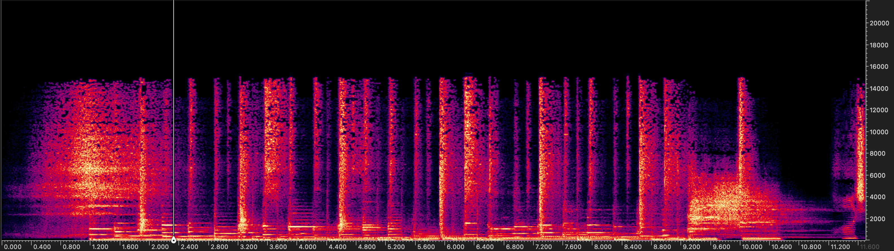
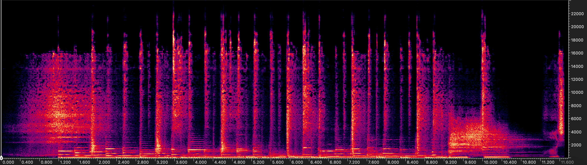
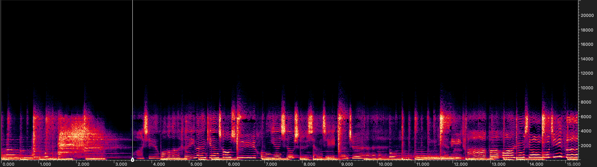

# Understanding the Impact of Cutoff Patterns on AudioSR Performance

**AudioSR** is a powerful tool for audio super-resolution. However, its performance can be significantly influenced by the characteristics of the input data, especially the cutoff pattern. 

## 🚩 When AudioSR May Fail
1. **Input Audio with Unfamiliar Cutoff Patterns**  
   If the input audio file contains a cutoff pattern that is **significantly different** from those used in training, AudioSR may fail to perform effectively.
   
2. **Input Audio with Severe Distortions**  
   Strong distortions such as excessive noise or reverb can degrade the performance of AudioSR.

## ❓ Why Do Cutoff Patterns Have Such a Huge Impact on AudioSR?
During training, our data was simulated using **low-pass filtering**. The model was not trained to handle other causes of high-frequency loss, such as MP3 compression. As a result, AudioSR struggles when encountering unfamiliar cutoff patterns.

For example, MP3 compression can introduce a cutoff pattern that looks like this:

### Why This Matters
As you can see, there are **spectrogram holes** near the cutoff range, which differ significantly from the patterns seen during training. When you apply AudioSR to such data, the output may look like this:

The higher frequencies are not adequately inpainted due to the unfamiliar cutoff pattern.

### A Simple Solution: Low-Pass Filtering
To mitigate this issue, you can perform a **low-pass filtering** on the audio before feeding it into AudioSR. After low-pass filtering, the audio would resemble a standard low-pass cutoff pattern, like this:

When processed by AudioSR, the output will then be as expected, with improved high-frequency inpainting:

---

By understanding the limitations and addressing them with preprocessing, you can maximize the performance of AudioSR!
